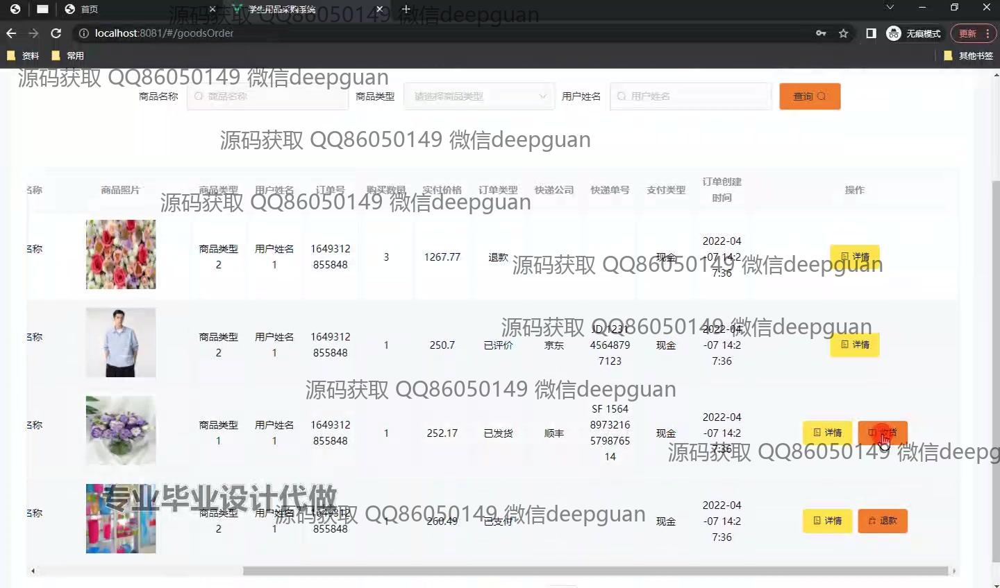

<h1 align="center">基于javaweb的学生用品采购系统</h1>

## 简介
学生用品采购系统：角色分为管理员、用户；商品浏览、购物车管理、订单处理、用户评价、库存管理、用户信息管理、订单查询。基于Java Web和Spring Boot开发，界面简洁，功能丰富，提升用户购物体验。    --计算机毕业设计源码；毕设源码；java毕业设计源码

## 联系方式

<h3 align="center">获取完整代码与数据库文件 + 微信：deepguan QQ: 86050149 QQ群: 783742310</h3>

<h3 align="center">可帮忙远程部署 包运行成功！提供远程部署、修改代码、设计文档指导、代码讲解等服务！</h3>

## 功能介绍（完整见运行截图）
用户：登录后可以浏览商品、查看商品详情并添加到购物车，支持订单查询和查看个人信息。通过购物车进行商品结算，选择支付方式并完成支付。用户可以在个人中心管理个人信息、查看历史订单和评论商品。

管理员：具备用户管理、商品管理和订单管理的权限。可以查看用户详细信息并执行修改或删除操作。负责商品信息的更新、库存管理以及处理订单，包括发货和退款申请。管理员可以通过系统后台管理导航栏进入管理界面，对整个系统进行监督和维护。

游客：可以在登录界面注册新账号，注册成功后可成为注册用户以获得更多的系统功能访问权限。未登录状态下，游客能够访问系统的首页和商品资讯，浏览部分商品信息但不能进行购买和订单管理等操作。

开发人员：通过Spring Boot与Java Web框架构建系统，界面设计简洁友好，涵盖用户、订单、商品和评论等模块的CRUD功能。系统注重用户体验提升，确保注册登录、商品浏览、购物车及后台管理功能的高效运作。

## 运行截图

本代码来源于网络,仅供学习参考使用!

